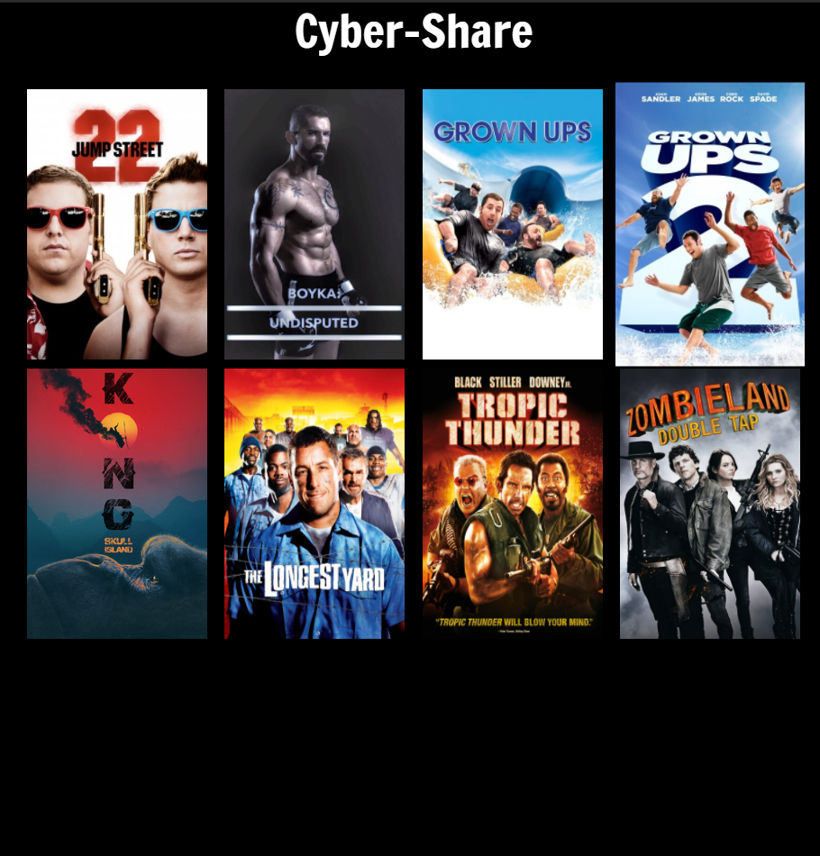
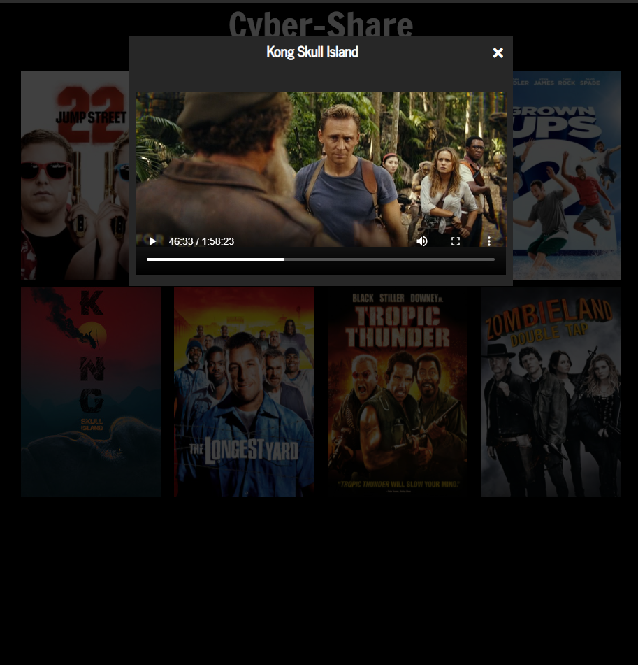

# Cyber-Share
A web server for movie sharing on a LAN.

# Previews:
 - ## Laptop view: 
  
 - ## Video Controls:
  
# Notes:
 - FFMPEG must be installed for the audio codec change to take place. If not it will fail.
 - When running `server.py` ypu should have every library installed. `pip install -r requirements.txt`

# Usage:
 - 1: Every movie should be in the `movies` folder.
 - 2: Inside the `movies` folder put all the folders for the movies. Label each folder with the title of the movie. For example; `./movies/tropic_thunder`
 - 3: Inside each movie folder, you should have the actual movie file and an image for the poster. (Should be vertical)
 - 4: Start up `server.py` and enjoy!

# Technologies used:
 - Flask
 - REACT

# Features:
 - Able to play movies in the browser.
 - If a movie has a bad audio codec, the script will give it one that is accepted by HTML5. (FFMPEG)